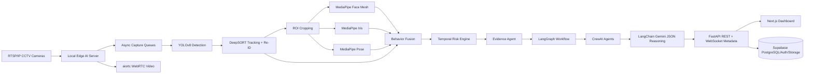
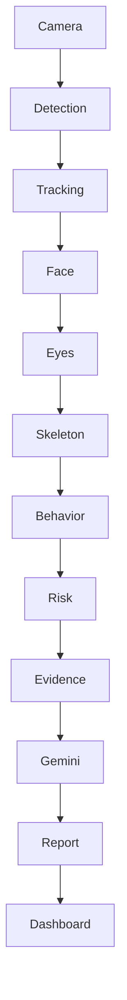

# Enterprise Smart Exam Surveillance Architecture

## Target Runtime

## Privacy Boundary

- Live CCTV and raw student video remain on the local Edge AI server.
- WebRTC streams video directly from the edge server to authorized clients.
- WebSocket sends alerts, analytics, metadata, notifications only.
- Gemini receives structured JSON metadata only; it never receives video, raw frames, or face images.
- Supabase stores metadata, reports, audit logs, and verified evidence artifacts only.

## Stateful Workflow

## Enterprise Modules Added

- `enterprise/core/schemas.py`: typed event contracts shared across agents and APIs.
- `enterprise/agents/*`: single-responsibility agents for detection, tracking, face, gaze, pose, behavior, risk, evidence, Gemini reasoning, reports, and invigilator assistance.
- `enterprise/workflows/langgraph_workflow.py`: central stateful orchestration graph with a fallback graph runner when LangGraph is unavailable.
- `enterprise/crews/exam_surveillance_crew.py`: CrewAI role definitions with deterministic local fallback.
- `enterprise/streaming/webrtc_gateway.py`: WebRTC-first video gateway and metadata-only WebSocket policy helpers.
- `enterprise/api/app.py`: FastAPI enterprise API surface for classrooms, cameras, alerts, analytics, reports, and WebRTC offers.
- `enterprise/db/schema.sql`: Supabase PostgreSQL schema with RLS-ready tables.
- `enterprise/config/enterprise.yaml`: production configuration template.

## Scaling Plan

- Run one capture worker per camera using `Queue(maxsize=1)` semantics to drop stale frames.
- Run YOLO at configurable frame skipping intervals and crop tracked ROIs for MediaPipe analysis.
- Use DeepSORT + seat mapping + optional face embeddings to prevent unnecessary ID switches.
- Batch Gemini reasoning behind Celery/Redis and trigger only after temporal risk thresholds are met.
- Use GPU acceleration through CUDA/TensorRT/ONNX Runtime where available.
